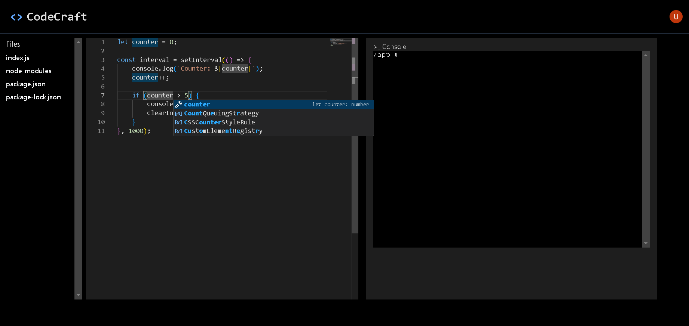

# CodeCrafter

 <!-- Replace this with your actual image -->

CodeCrafter is a powerful, lightweight REPL platform that allows users to run and test simple Node.js and Python code in isolated Docker environments. This project is ideal for showcasing your coding skills, working on small-scale projects, and experiencing REPL functionality with easy-to-use features and a clean interface.

## Features

- **Python & JavaScript Support**: Write and run code in two of the most popular programming languages.
- **Instant Execution**: See your code come to life instantly
- **Multiple REPL Support**: Open multiple REPLs simultaneously, each with its own environment.
- **Browser Based IDE**: Code from anywhere, anytime. No installation required.

## Tech Stack

-  **React** for building the frontend interface.
-  **TypeScript** for a robust and type-safe codebase.
-  **Node.js** for backend and server-side operations.
-  **xterm.js** for terminal emulation in the browser.
-  **node-pty** for handling pseudoterminal creation and shell execution.
-  **Docker** for containerized, secure code execution environments.
-  **Clerk** for authentication and user management.